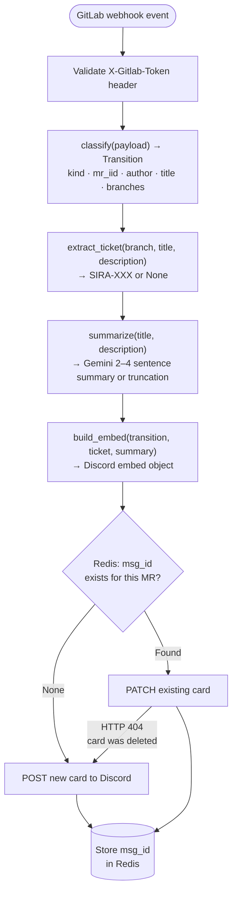
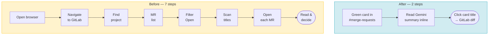
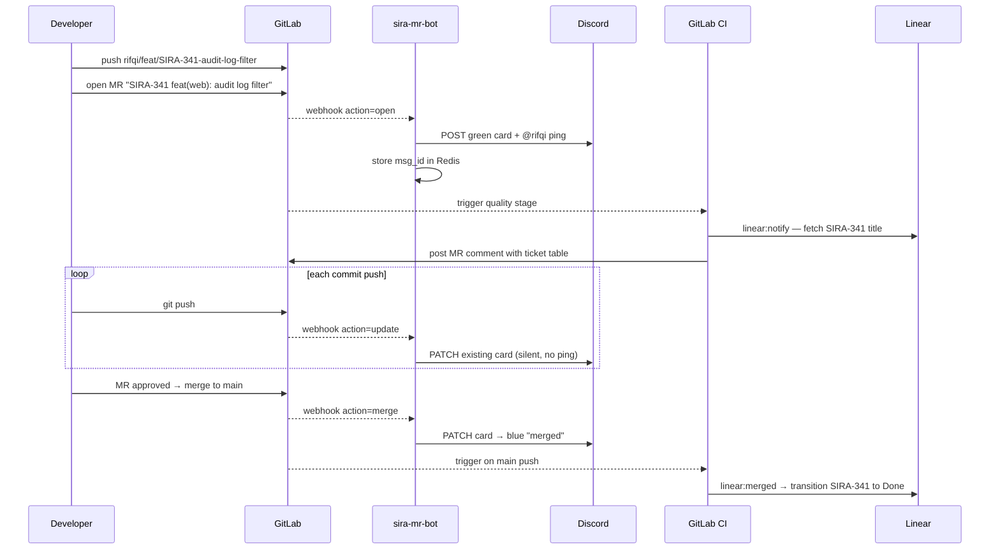

The friction in team development isn't usually the code. It's the overhead around the code: knowing what's in review, who's working on what, whether a ticket moved, whether that MR you were waiting on is finally merged. Most teams solve this by adding a status-update ritual — a daily standup field, a manual Discord message, a ticket that someone remembers to update after they're done. This works until someone forgets, or the meeting cadence doesn't match the merge cadence, or you're on a different timezone.

The alternative is to make the toolchain do it. SIRA connects three systems — Git branches, Linear tickets, Discord channels — in a loop that updates itself. When a merge request opens, Discord finds out. When it merges, Linear closes the ticket. Nothing waits for a human to announce it.

Here's how the chain is wired.

## The Naming Convention Is the Integration Layer

Every connection between Git, Linear, and Discord flows through a single artifact: the branch name. The convention is enforced in `AGENTS.md` and in the pre-push hook's branch-name validator:

```
<name>/<type>/<SIRA-XX>-<short-description>
```

Examples:
```
abhip/feat/SIRA-186-bell
bertrand/fix/SIRA-26-auth-redirect-loop
rifqi/feat/SIRA-341-fe-audit-log-filter
```

The `SIRA-XX` segment is the Linear ticket number. Everything downstream — the MR bot, the CI notify scripts, the merge hook — extracts this token and uses it as the key to both Linear and the Discord card. There's no separate "link to ticket" step. The ticket link is in the branch name.

The extraction logic in the MR bot (`services/sira-mr-bot/src/sira_mr_bot/linear.py`) is four lines:

```python
_TICKET_RE = re.compile(r"SIRA-\d+", re.IGNORECASE)

def extract_ticket(branch: str, title: str, description: str) -> str | None:
    """Return the first SIRA-NNN ticket found across branch, title, description.

    Branch is checked first — branch naming is enforced, making it the most reliable source.
    """
    for source in (branch, title, description):
        match = _TICKET_RE.search(source)
        if match:
            return match.group(0).upper()
    return None
```

Branch first, then MR title, then description. The priority order reflects reliability: branch names pass a format validator; MR titles are free text that a developer types once; descriptions are optional. If all three disagree, the branch wins.

## The MR Bot: What It Actually Does

`sira-mr-bot` is a FastAPI service that listens for GitLab merge request webhook events and translates them into Discord embed cards. It doesn't use `discord.py` — it talks to the Discord webhook API directly over `httpx`, which keeps the dependency surface small.



The Redis state keeps the bot idempotent. Every MR has at most one Discord card. Status updates edit the existing card rather than posting new messages. A channel with 10 active MRs has 10 cards, not 10 × (number-of-commits) messages.

## The Four Transition States

GitLab webhook actions map to four states, each with a distinct color and behavior:

| Transition | Trigger | Embed color | Footer | Discord ping |
|---|---|---|---|---|
| OPENED | `action=open`, not draft | Green | "opened" | Yes — `<@discord_id>` in message body |
| DRAFTED | `action=open`, draft=true | Yellow | "drafted" | No |
| MERGED | `action=merge` | Blue | "merged" | No |
| CLOSED | `action=close` | Red | "closed" | No |

The ping on OPENED deserves explanation. Discord only triggers desktop notifications for mentions in the message body, not inside embed fields. The bot posts the embed as `embed:` and separately sets `content: "<@1234567890>"` — the mention fires the notification; the embed carries the detail. Every other state transition silently edits the existing card. Reviewers don't get pinged every time a commit is added; only the author gets pinged when the MR is ready for review.

User mapping is in `/opt/sira-mr-bot/users.json`, which maps GitLab usernames to Discord user IDs:

```json
{
  "abhip": "111111111111111111",
  "bertrand": "222222222222222222",
  "rifqi": "333333333333333333"
}
```

The bot watches the file's mtime and reloads it on change — no restart needed when someone joins the team. This is the smallest possible version of dynamic configuration: a JSON file on disk, watched for changes, applied live.

## What the Discord Card Looks Like

The embed object the bot builds:

```python
def build_embed(
    transition: Transition,
    ticket: str | None,
    summary: str,
) -> dict[str, Any]:
    color = _COLORS[transition.kind]   # green / yellow / blue / red
    title = f"MR !{transition.mr_iid}"
    if ticket:
        title += f" · {ticket}"
    title += f" {transition.mr_title}"

    fields = [
        {"name": "Author", "value": transition.author, "inline": True},
        {
            "name": "Branch",
            "value": f"`{transition.source}` → `{transition.target}`",
            "inline": True,
        },
    ]
    if ticket:
        fields.append({"name": "Linear", "value": ticket, "inline": True})

    return {
        "color": color,
        "title": title,
        "url": transition.mr_url,
        "description": summary,
        "fields": fields,
        "footer": {"text": transition.kind.value.lower()},
    }
```

A card for MR !271 opening looks like:

```
[GREEN]  MR !271 · SIRA-186 feat(api,web): in-app notification center
         Adds a notification bell icon to the nav bar with unread counts.
         Clicking the bell opens a dropdown with the 10 most recent events.

         Author:  abhip            Branch: abhip/feat/SIRA-186-bell → main
         Linear:  SIRA-186

         opened
```

The description comes from Gemini — a 2–4 sentence summary of the MR title and description. If Gemini is unavailable or times out, the bot falls back to a truncated version of the MR description. The embed is still posted; the summary is just shorter.

## The Reviewer Experience

Before this system existed, finding open MRs to review required a manual GitLab detour. With the bot, that collapses to two steps:



The card title is the `url` field in the Discord embed — it renders as a hyperlink directly to `$CI_PROJECT_URL/-/merge_requests/$MR_IID`. One click from Discord to the diff, no navigation required.

### What the Card Tells You Without Opening GitLab

Every field on the card is chosen to answer a specific reviewer question:

| Card field | Reviewer question answered |
|---|---|
| Color (green) | Is this MR ready for review right now, or still a draft? |
| Title + MR number | Which MR is this, and what does it do at a glance? |
| Description (Gemini summary) | Do I understand what changed enough to know if I should review it? |
| Author field | Who owns this — is it mine to review or someone else's? |
| Branch field (`source → target`) | What feature branch is this, and is it targeting main? |
| Linear field | Which ticket does this close — can I see the acceptance criteria? |
| Footer ("opened" / "drafted" / "merged") | What state is this MR in right now? |

The color is the primary triage signal. Green means the author considers it ready for review. Yellow means it's a draft — visible for awareness, but not requesting review attention yet. A reviewer scanning a channel with five cards can immediately tell which ones need action (green) and which ones to skip for now (yellow).

### Draft MRs Are Visible Without Being Noisy

When a developer pushes a draft MR, the bot posts a yellow card with no ping:

```
[YELLOW]  MR !284 · SIRA-201 feat(api): batch invoice export endpoint
          Adds a /invoices/export endpoint that returns a paginated CSV stream.
          Auth and rate-limiting middleware still to be wired.

          Author:  bertrand          Branch: bertrand/feat/SIRA-201-export → main
          Linear:  SIRA-201

          drafted
```

The card is in the channel, so anyone can see that work-in-progress exists on SIRA-201. No notification fires. When the developer marks it ready, GitLab sends a new webhook event, the bot PATCHes the card to green, and the author gets pinged. The transition from draft to ready-for-review is the notification — not the initial push.

This distinction matters for teams with long-running feature branches. A draft card says "I'm working on this" without demanding review time. A green card says "I need eyes on this now."

### The Channel as a Live MR Dashboard

Because the bot edits existing cards rather than posting new ones, the Discord channel naturally becomes a live dashboard of open MRs. Each card represents one MR. Status changes update the card in place. When an MR merges, its card turns blue. When it's closed, red.

At any point, a team member can scroll the channel and see:
- All open MRs (green cards) waiting for review
- All draft MRs (yellow) in progress
- Recently merged MRs (blue) with their Gemini summary as a lightweight changelog
- Closed/abandoned MRs (red)

No GitLab tab required. The channel retains the recent history without being cluttered by repeated status messages — one card per MR, updated in place, for the lifetime of that MR.

### The Ping That Actually Lands

One detail in the bot implementation is non-obvious: the author mention (`<@discord_id>`) is placed in the message `content` field, not inside the embed. Discord only triggers desktop and mobile push notifications for mentions in the message body. Mentions inside embed fields are rendered visually but don't fire a notification.

```python
if transition.kind == TransitionKind.OPENED:
    content = f"<@{discord_user_id}>"   # fires notification
else:
    content = ""   # silent edit — no notification

await post_or_patch(
    content=content,
    embeds=[build_embed(transition, ticket, summary)],
)
```

The author gets notified once — when the MR opens and is ready for review. Every subsequent status update (commits pushed, state changed) silently edits the card. Reviewers can also react to the card or reply in a thread without triggering repeated pings on the author's side.

## The Gemini Summary Layer

The MR bot uses Google's Gemini API to write the description field:

```python
async def summarize(title: str, description: str) -> str:
    """Generate a 2–4 sentence plain-paragraph summary of MR changes.

    Falls back to truncated description if Gemini is unavailable.
    """
    if not settings.GEMINI_API_KEY:
        return _truncate(description)
    try:
        response = await _gemini_client.generate_content(
            f"Summarize this merge request in 2-4 plain sentences:\n\nTitle: {title}\n\n{description}"
        )
        text = response.text.strip()
        # Strip markdown if Gemini returns structured output
        text = re.sub(r"[#*`_]", "", text)
        return text
    except Exception:
        return _truncate(description)
```

The defensive post-processing (`re.sub(r"[#*`_]", "")`) handles a real failure mode: Gemini sometimes returns Markdown-formatted output even when asked for plain text. Stripping the markup keeps the Discord card readable regardless.

Summaries are cached in Redis keyed by `mr_iid`. If the same MR webhook fires twice (e.g., on a commit push), the bot reuses the cached summary rather than calling Gemini again. This avoids rate-limit cost and keeps the summary consistent across edits.

## Error Recovery: The Three Failure Modes

Three things can go wrong with the Discord integration. All three are handled:

**1. Discord rate-limits the bot (HTTP 429)**

```python
async def _post_or_patch(self, method: str, url: str, payload: dict) -> Response:
    response = await self._client.request(method, url, json=payload)
    if response.status_code == 429:
        retry_after = min(response.json().get("retry_after", 1.0), 5.0)
        await asyncio.sleep(retry_after)
        response = await self._client.request(method, url, json=payload)
    return response
```

Rate-limit sleep is capped at 5 seconds. Discord's `retry_after` field gives the exact wait. One retry per request — if the second attempt also rate-limits, the card isn't posted (but the webhook doesn't retry anyway, so this is acceptable).

**2. The Discord card was deleted by a human (HTTP 404 on PATCH)**

```python
if response.status_code == 404:
    # Card was deleted — repost a fresh one
    new_response = await self._client.post(webhook_url, json={"embeds": [embed]})
    new_msg_id = new_response.json()["id"]
    await redis.set(f"msg:{mr_iid}", new_msg_id)
```

If someone deletes the Discord card, the next status update detects the 404, posts a new card, and updates the Redis key. The channel self-heals without manual intervention.

**3. Redis is down**

The bot falls back gracefully: if Redis is unreachable, it skips the state lookup and posts a new card. This means a Redis outage produces duplicate cards (one per status update) rather than a complete bot failure. The duplicates are annoying but visible; a silent failure would be invisible.

## The CI Side: Linear Status Transitions

The Discord bot handles the team-facing view. The CI pipeline handles the Linear-facing view. Two jobs in the `quality` stage:

**`linear:notify`** — runs when an MR is opened. Extracts the SIRA ticket from the branch name, queries Linear's GraphQL API for the issue title, and posts a table comment on the MR:

```bash
bash scripts/linear-notify.sh mr-opened \
  "$CI_MERGE_REQUEST_SOURCE_BRANCH_NAME" \
  "$CI_MERGE_REQUEST_TITLE" \
  "$CI_PROJECT_URL/-/merge_requests/$CI_MERGE_REQUEST_IID" \
  "$CI_MERGE_REQUEST_IID"
```

The comment looks like:

```markdown
| Linear | Title | MR |
|--------|-------|-----|
| SIRA-186 | feat: in-app notification center | !271 |
```

The MR comment creates a bidirectional link: Linear → GitLab is visible in the Linear ticket (via the Linear GitLab integration), and GitLab → Linear is visible in the MR comment.

**`linear:merged`** — runs when a commit lands on `main`. Extracts the ticket from the commit message, calls Linear's API to transition the issue to "Done":

```bash
bash scripts/linear-notify.sh mr-merged \
  "$(echo "$CI_COMMIT_MESSAGE" | head -1)" \
  "$CI_COMMIT_MESSAGE"
```

The ticket closes automatically on merge. Nobody has to remember to update it.

## The Full Loop



## Before and After the Automation

Before this system existed, the equivalent workflow looked like:

| Action | Before (manual) | After (automated) |
|---|---|---|
| Team learns an MR is open | Developer posts in #general manually | Bot posts green card with author ping within seconds of `git push` |
| Reviewer finds MR to review | GitLab → project → MRs → filter Open → scan list (7 steps) | See green card in channel → click title → lands on diff (2 steps) |
| Reviewer understands what an MR does | Opens GitLab, reads full description | Reads 3-sentence Gemini summary inline on the Discord card |
| Reviewer knows if MR is ready vs WIP | Checks MR "Draft" label on GitLab | Green = ready, yellow = draft — visible at a glance in channel |
| MR status update after new commit | Developer re-posts or edits Discord message | Bot silently PATCHes existing card — no noise, card stays current |
| See all active MRs at a glance | Navigate GitLab MR list | Scroll Discord channel — one card per MR, color-coded by state |
| Linear ticket linked to MR | Developer copies MR URL into Linear manually | CI job posts table comment on MR open |
| Ticket closed on merge | Developer remembers to move ticket to Done | CI job transitions ticket on main push |

The manual version scales to one developer reliably. At four developers with several active MRs per sprint, the overhead compounds — someone always forgets to ping, someone's ticket stays "In Progress" for three days after it merged, reviewers can't tell which MRs need attention.

## Design Decisions Worth Noting

**Why not use the official discord.py library?** The bot only needs to POST and PATCH webhooks — two endpoints, no event loop, no gateway connection. `httpx` handles both with less surface area than pulling in a full Discord client library. The fewer moving parts, the easier the service is to operate.

**Why bash for Linear, not Python?** The Linear notify scripts run inside GitLab CI jobs that already have bash and curl. A Python script would need a runtime and dependencies installed in the CI container for three API calls. The bash scripts are self-contained and faster to maintain for this narrow use case.

**Why Redis for message IDs?** The alternative is posting a new Discord card on every webhook event. For an active MR with 20 commits, that's 20 cards in the channel. Redis keeps one card per MR and updates it in place. The cost is one external service; the benefit is a channel that stays readable.

**Why Gemini for summaries instead of a template?** A template would format the MR title and first line of description. Gemini generates a description that actually explains what the MR does, drawing from the full description body. For short MRs, the difference is minor. For large feature MRs with a detailed description, the Gemini summary gives reviewers useful context before they open the diff.

The system has been running since the sprint that introduced it. The Discord channel now reflects what the team is actually doing, in real time, without anyone having to maintain it.
