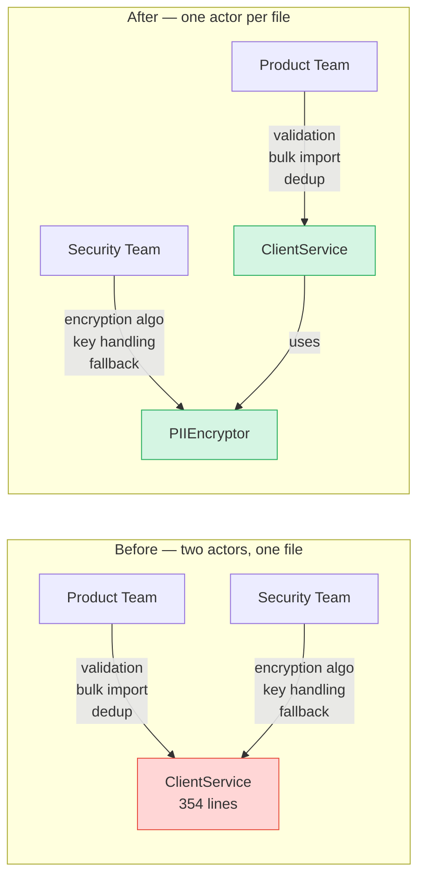
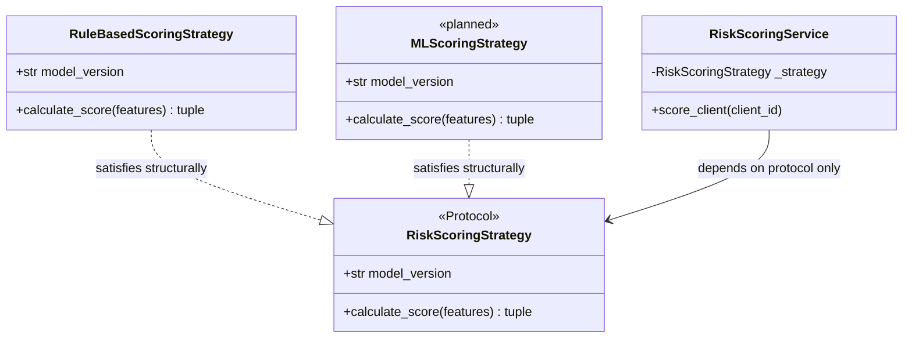
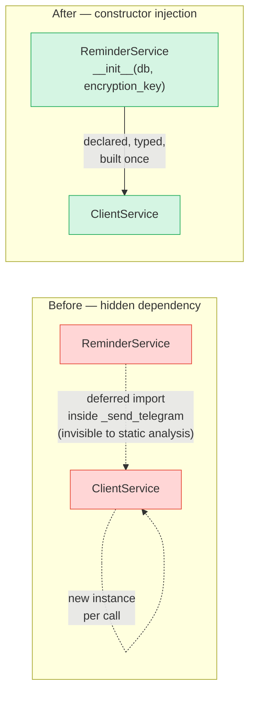
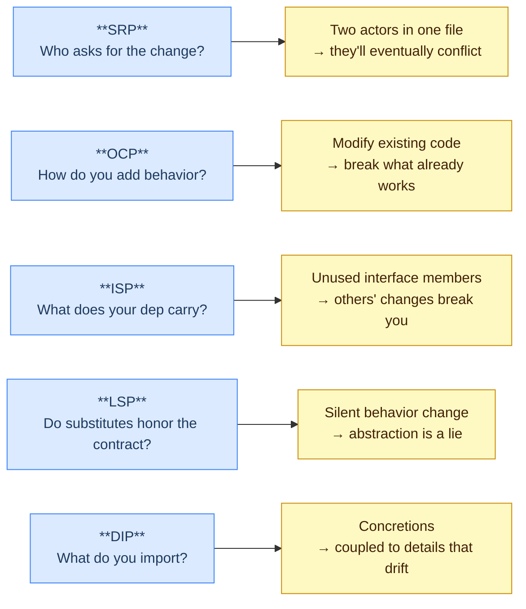

Most SOLID explainers give you five definitions and move on. The part they skip is showing up in a codebase that already works, finding where each principle is being violated, and making the case that fixing it actually changed anything.

One sprint last month on a FastAPI invoice-reminder service cluster: five code smells, five named fixes, each grounded in Martin's actual formulation from *Clean Architecture* — not the flashcard summaries that circulate online. The precise wording matters. In several cases it's what makes the violation visible in the first place.

Not everything landed at the same quality level. I'll tell you where it did and where it didn't.

## SRP: ClientService had two actors

Martin's formulation: *"A module should be responsible to one, and only one, actor."* The actor framing is the part that usually gets dropped. Two responsibilities don't violate SRP because they're different in kind — they violate it because they're owned by different stakeholders who request changes independently.

`ClientService` was 354 lines when I picked up the sprint. Nothing was broken — tests passed, CI was green, the feature was shipping. The smell was subtler: every time I touched anything PII-related, I'd Ctrl+F the file to find every `encrypt()` call, because I didn't trust myself to remember all three locations. That reflex is the tell.

Martin's actor framing makes the diagnosis precise. `ClientService` served two distinct stakeholders: the product team (client validation, bulk imports, deduplication logic) and the security team (encryption algorithm, key handling, fallback behavior for legacy plaintext). If a requirement came from either side, both would touch the same file, modifying code the other actor hadn't asked to change.

The fix was an Extract Class refactor that produced `PIIEncryptor`:

```python
class PIIEncryptor:
    def __init__(self, key: str, fields: tuple[str, ...]) -> None:
        self._key = key
        self._fields = fields

    def encrypt_field(self, value: str | None) -> str | None:
        return encrypt(value, self._key) if value else None

    def decrypt_row(self, row: dict[str, Any]) -> dict[str, Any]:
        decrypted = {**row}
        for field in self._fields:
            decrypted[field] = self._decrypt_field(row, field)
        return decrypted
```

`ClientService.__init__` now reads: `self._pii = PIIEncryptor(encryption_key, PII_FIELDS)`. The product team's actor touches `ClientService`; the security team's actor touches `PIIEncryptor`. They no longer share a file.



A side effect I didn't plan for: extracting the crypto to its own class made the error handling visible. The old `_decrypt_pii_field` method inside `ClientService` caught both `ValueError` and `InvalidTag` silently — returning the raw value in both cases with no log, no signal. When the crypto moved, I could see the two cases clearly and treat them differently: `WARNING` for `ValueError` (expected legacy plaintext — we know some data was stored unencrypted before the migration), `ERROR` for `InvalidTag` (key mismatch or data corruption — unexpected). Now Sentry has something to fire on, and there's a message worth reading when it does.

The SRP diagnosis — two actors, one file — isn't just structural cleanliness. It's the reason improving the error handling felt like a natural next step once the class existed.

## OCP + ISP + LSP: the RiskScoringStrategy Protocol

Three definitions that matter here. **OCP**: a software artifact should be open for extension but closed for modification — the operative question is whether adding a new thing requires changing what already exists. **ISP**: depending on something that carries baggage you don't need can cause you troubles you didn't expect. **LSP**: subtypes must honor the contract of the types they replace; a subtype that silently changes what the caller expects is violating LSP even if it compiles.

`RiskScoringService` runs a deterministic weighted formula today. The roadmap has an ML scoring model. The classic OCP trap is designing the abstraction before you know the extension's shape — you write an abstract base class that turns out to have the wrong interface when the real use case arrives.

Python's `typing.Protocol` offers a different path. Instead of declaring what a strategy class must *inherit*, you declare what it must *do*:

```python
@runtime_checkable
class RiskScoringStrategy(Protocol):
    model_version: str

    def calculate_score(
        self, features: dict[str, Any]
    ) -> tuple[float, Literal["LOW", "MEDIUM", "HIGH"]]:
        ...
```

Any class that has a `model_version` attribute and a `calculate_score` method with the right signature satisfies this protocol structurally — no registration, no import, no base class in the file. `RiskScoringService` accepts it at construction:

```python
class RiskScoringService:
    def __init__(
        self,
        db: Client,
        strategy: RiskScoringStrategy | None = None,
    ) -> None:
        self._strategy: RiskScoringStrategy = (
            strategy if strategy is not None else RuleBasedScoringStrategy()
        )
```

This is **OCP in practice**: adding an ML strategy means writing a new class and passing it in. The service doesn't change.

It's also **ISP in practice**: `RiskScoringStrategy` has exactly two members. An implementor is never asked to provide a method it doesn't conceptually own. There's no bloated base class forcing concrete strategies to define `get_summary()` or `persist_log()` — those belong to the service, not the strategy.

And it's **LSP in practice**: `@runtime_checkable` means you can assert `isinstance(strategy, RiskScoringStrategy)` in tests. The contract is explicit and verifiable at runtime. A strategy that claims to implement `calculate_score` but returns a string instead of `tuple[float, Literal["LOW", "MEDIUM", "HIGH"]]` is caught by mypy before it reaches the service. The behavioral contract is encoded in the type signature, not in a docstring that can go stale.

What's honest to say about LSP here: the guarantee is real, but it hasn't been exercised by an actual substitution yet. Only `RuleBasedScoringStrategy` exists in production. The ML strategy is planned. The protocol is the bet that when it arrives, the service won't need to change — and `@runtime_checkable` is the way to verify that bet before wiring anything up.



The three principles in one place is the creative part I want to flag. In inheritance-based languages, OCP, ISP, and LSP are often addressed with separate machinery — abstract base classes for OCP, separate interface types for ISP, explicit override rules for LSP. Python's structural typing via `Protocol` collapses all three into one declaration. The protocol is narrow enough for ISP, checkable enough for LSP, and the injection point in the constructor handles OCP.

## DIP: ReminderService's hidden dependency

Martin: *"The most flexible systems are those in which source code dependencies refer only to abstractions, not to concretions."* High-level modules (policy) shouldn't import low-level modules (mechanism) directly.

`ReminderService._send_telegram` had a deferred import inside the method body:

```python
def _send_telegram(self, invoice):
    from app.services.client_service import ClientService   # hidden here
    client_svc = ClientService(self._db, self._key)         # built on every call
    client = asyncio.run(client_svc.get_client(invoice["client_id"]))
```

This violates DIP in two ways. First, `ReminderService` (high-level orchestration) directly instantiates `ClientService` (lower-level mechanism) inside a method. The high-level module reaches down and creates the concretion. Second: the deferred import hides this dependency from static analysis. Any tool building a dependency graph by reading `__init__` sees `db` and `encryption_key`. It doesn't see `ClientService`.

The fix was constructor injection:

```python
class ReminderService:
    def __init__(self, db, encryption_key):
        self._client_service: ClientService | None = (
            ClientService(db, encryption_key) if encryption_key else None
        )
```

The dependency is declared, typed, and built once. The `ClientService | None` annotation matters: mypy flags any code path that uses `_client_service` without checking for `None` first. That catches exactly the kind of mistake the deferred-import pattern lets through silently.



There was also a subtle risk I didn't notice until looking at it carefully: deferred imports suppress circular import errors until runtime. With a top-level import, if `client_service.py` ever imported from `reminder_service.py`, Python would catch the cycle at module load. With a deferred import, you find out in production when `_send_telegram` runs. The fix exposes this risk where it belongs — at startup.

One practical observation: with the deferred pattern, every Telegram send built a new `ClientService`, which after the SRP refactor also built a new `PIIEncryptor`. At fifty reminders in a batch, that's fifty object graphs instantiated and discarded. Constructor injection builds it once. At current scale, this is small. At hundreds of invoices, the N+1 object construction would have become measurable.

## Where I deliberately didn't apply it

The daily reminder job iterates over overdue invoices, batch-fetches the relevant clients, and dispatches reminders. You could argue the function has multiple responsibilities: fetching invoices, fetching clients, dispatching, logging.

I left it as-is, and it was a deliberate call.

SRP violations are diagnosed by asking whether two independent actors would request changes to the same file for unrelated reasons. In this job's case, every change would come from the same team for the same reason: "the daily job isn't working right." Product, operations, and engineering all point at the same artifact. There's no second actor fighting over it. Splitting the function into smaller classes to satisfy a count-based interpretation of SRP would have added indirection without solving the problem Martin describes.

Martin is clear about this in *Clean Architecture*: SRP isn't about what a module *does*, it's about who *asks for it to change*. Applying it where there's no conflicting actor is premature structure.

## What the five principles are actually testing for



Reading Martin carefully, the SOLID principles aren't primarily about class size or method count. They're about where change originates and how far it propagates.

SRP says: when two independent change sources live in the same artifact, they'll eventually interfere with each other. OCP says: if the only way to extend is to modify, you'll break things that were working. ISP says: if a dependency carries things you don't use, someone else's changes can break you for no reason. DIP says: if you depend on concretions, you're coupled to details that change faster than policy. LSP says: if your substitutes don't honor contracts, the abstraction was a fiction.

Each one is a question about *coupling* — different in kind, but all pointing at the same failure mode: a change in one part of the system propagating unexpectedly to another.

The SRP refactor on `ClientService` meant a future encryption-algorithm change would touch `PIIEncryptor` only. The OCP design in `RiskScoringService` means swapping in an ML model won't touch the service that orchestrates scoring. The DIP fix in `ReminderService` means its dependency graph is visible, testable, and honest about what it needs.

Three services. Five principles. One sprint. The LSP bet is unverified by a real substitution yet, and the job's SRP was deliberately left alone. But I can point to code that got measurably better from applying each principle that was applied — which is, in the end, the only evidence worth presenting.
