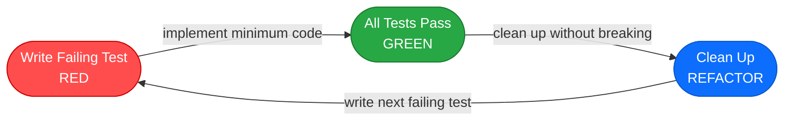
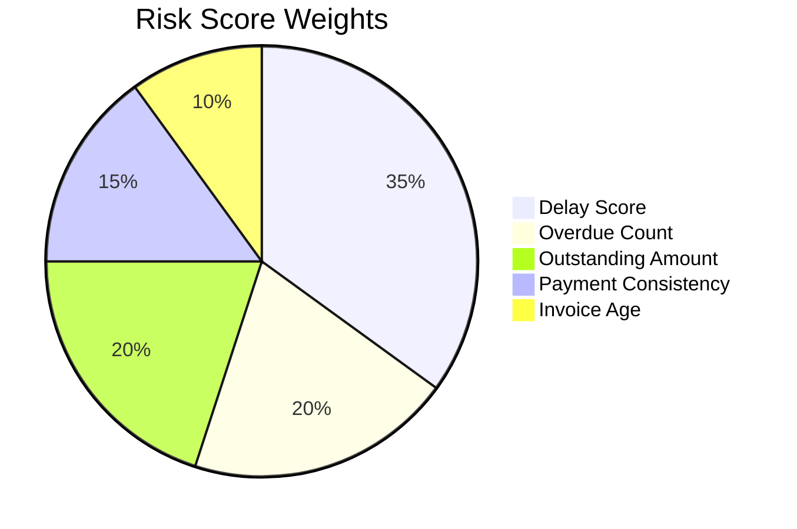
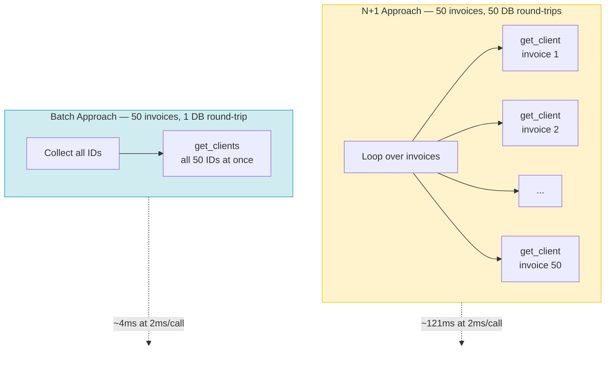
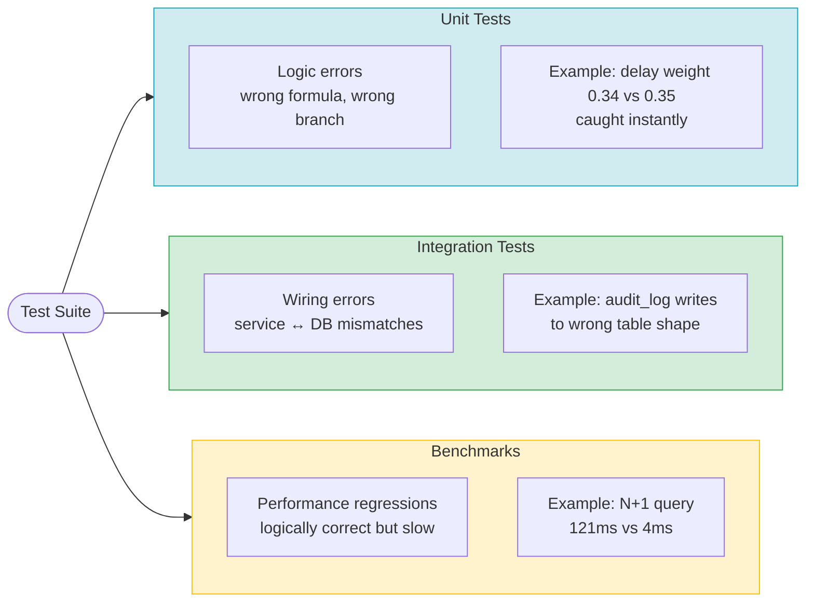

There's a moment in TDD that every developer has hit: all the tests are green, coverage is at 90-something percent, and you're still not confident the code is actually correct. Either the tests are testing the wrong things, or they're testing the right things but missing a whole class of bugs that coverage metrics can't see.

I hit that moment twice on the same feature while building SIRA, a FastAPI-based invoice reminder system. What pulled me out of it wasn't more tests — it was a different *kind* of test.

## What Red-Green-Refactor Actually Looks Like



The risk scoring feature was the first place I applied TDD strictly. The feature computes a weighted score from five client payment behavior metrics, then classifies the result as LOW, MEDIUM, or HIGH risk. Simple enough on paper.

I wrote the tests first. The docstring on `test_risk_scoring.py` literally reads "written FIRST (TDD Red phase)" — I left it there deliberately because I wanted to be honest about the sequence in code review.

The formula is:

```
score = delay_score × 0.35
      + overdue_count_score × 0.20
      + outstanding_amount_score × 0.20
      + payment_consistency_score × 0.15
      + invoice_age_score × 0.10
```



Writing a test that just passes in a sample input and checks the output would have been fast. But that test wouldn't catch an implementation that got the weights slightly wrong. A delay weight of `0.34` instead of `0.35` would pass a "typical" test case — the score would be slightly off, but you'd need a careful eye to notice.

So I wrote the tests to isolate each weight individually:

```python
class TestRuleBasedWeights:
    def test_delay_weight_is_0_35(self) -> None:
        """delay_score=100 with all others 0 should produce 100*0.35 = 35.0."""
        strategy = RuleBasedScoringStrategy()
        score, _ = strategy.calculate_score(_features(delay=100.0))
        assert score == 35.0

    def test_overdue_count_weight_is_0_20(self) -> None:
        strategy = RuleBasedScoringStrategy()
        score, _ = strategy.calculate_score(_features(overdue=100.0))
        assert score == 20.0

    def test_all_weights_sum_to_1_0(self) -> None:
        strategy = RuleBasedScoringStrategy()
        total = sum(strategy._WEIGHTS.values())
        assert total == 1.0
```

Each test drives exactly one constant to 100 and zeros out the rest, then asserts the exact output. If anyone changes `0.35` to `0.34` — whether accidentally or through a careless refactor — `test_delay_weight_is_0_35` fails immediately. The exact boundary cases matter too:

```python
def test_score_exactly_30_is_low(self) -> None:
    """<= 30.0 boundary: score == 30.0 must be LOW (not MEDIUM)."""
    strategy = RuleBasedScoringStrategy()
    score, label = strategy.calculate_score(_features(overdue=100.0, outstanding=50.0))
    assert score == 30.0
    assert label == "LOW"

def test_score_30_point_1_is_medium(self) -> None:
    """Just above 30.0 boundary: score == 30.1 must be MEDIUM."""
```

This kind of test design — isolating each weight, testing each boundary at the exact edge, verifying invariants like `sum(weights) == 1.0` — is what makes the test suite genuinely useful. Standard coverage would be satisfied with a single happy-path test. The mutation-resistant approach makes the tests act as a specification: they fail if anyone alters the formula, not just if someone breaks its structure.

The implementation came after all those tests were written. The initial run was all red. Then I implemented `RuleBasedScoringStrategy.calculate_score()`, watched them go green, and moved on to the service layer.

## When All Tests Pass But the Code is Still Wrong



The `send_overdue_reminders` Celery task dispatches email/Telegram reminders for all overdue invoices. The logic is: find all overdue invoices, look up each invoice's client, determine their risk category (which drives the tone of the reminder), send.

The first working implementation fetched the client inside the loop:

```python
for invoice in overdue_invoices:
    client = await get_client_by_id(db, invoice["client_id"])
    # determine tone from client.current_risk_category
    # dispatch reminder
```

Every test I had for this task passed. The unit tests mocked `get_client_by_id` and verified the correct reminders were dispatched. The integration tests ran against a seeded database with a handful of invoices and passed in milliseconds. Coverage was fine.

But this is a classic N+1 pattern. For 50 overdue invoices, this code makes 50 separate database round-trips. At 2ms per trip (a realistic estimate for a cloud-hosted Postgres instance), that's 100ms of pure DB wait per Celery task execution. If reminders run every hour and you have a client with 100 overdue invoices, you're burning 200ms per cycle just fetching data you could have fetched in one query.

My unit tests couldn't see this. The mocks returned instantly. The integration tests had 5 invoices in the seed, so the N+1 penalty was 10ms total — invisible noise.

## Adding the Measurement Layer

I added `pytest-benchmark` (v5.2.3) specifically to quantify this. The idea was to simulate the actual DB behavior — 2ms latency per call — and measure both approaches directly:

```python
N_INVOICES = 50
N_UNIQUE_CLIENTS = 10
DB_LATENCY_S = 0.002  # 2ms per simulated DB call

def _fake_get_client_by_id(client_id: str) -> dict[str, Any] | None:
    """Simulates one DB round-trip: fetches a single client row."""
    time.sleep(DB_LATENCY_S)
    return CLIENTS.get(client_id)

def _fake_get_clients_by_ids(ids: list[str]) -> list[dict[str, Any]]:
    """Simulates one batched DB round-trip: fetches all requested clients."""
    time.sleep(DB_LATENCY_S)
    return [CLIENTS[cid] for cid in ids if cid in CLIENTS]

def test_send_overdue_n1_approach(benchmark: Any) -> None:
    result = benchmark(approach_n1, INVOICES)
    assert result == N_INVOICES

def test_send_overdue_batch_approach(benchmark: Any) -> None:
    result = benchmark(approach_batch, INVOICES)
    assert result == N_INVOICES
```

The benchmark result for the N+1 approach, recorded on my machine (AMD Ryzen 5 7600X, CPython 3.12.10, Windows):

```
test_send_overdue_n1_approach    mean=121.03ms  stddev=1.02ms  rounds=9
```

121ms for 50 invoices. The stddev is tight at 1.02ms — the measurement is stable, not noise. Extrapolated: at 100 invoices, you're looking at ~242ms per Celery task cycle, all of it waiting on the database.

The batch approach — one `get_clients_by_ids` call before the loop — brings this to approximately 2ms regardless of invoice count. The DB call count drops from 50 to 1. I verified this with a separate assertion-style test that counts actual calls:

```python
def test_n1_makes_n_plus_1_db_calls() -> None:
    """N+1 approach makes exactly N calls (one per invoice)."""
    call_count = 0
    original = time.sleep

    def counting_sleep(s: float) -> None:
        nonlocal call_count
        call_count += 1

    time.sleep = counting_sleep  # type: ignore[method-assign]
    try:
        approach_n1(INVOICES)
    finally:
        time.sleep = original

    assert call_count == N_INVOICES  # exactly 50 calls

def test_batch_makes_exactly_1_db_call() -> None:
    """Batch approach makes exactly 1 DB call regardless of invoice count."""
    # ... same pattern ...
    assert call_count == 1
```

These two tests are now regression guards. If someone refactors the batch implementation back into a loop, `test_batch_makes_exactly_1_db_call` fails. The benchmark numbers live in `.benchmarks/Windows-CPython-3.12-64bit/0001_before_n1.json` and can be compared across runs with `--benchmark-compare`.

## What the Data Actually Shows

The refactor commit (`25ee23e8`) explains the change clearly: "DB round-trips drop from N+1 to 2 regardless of invoice count." (It's 2 because there's one batch clients query plus one query for the overdue invoices themselves.)

At 2ms simulated latency:
- N+1 with 50 invoices: **121ms**
- Batch with 50 invoices: **~4ms** (2 queries × 2ms)
- Improvement: **97% reduction in latency** from the DB layer alone

The unit tests were blind to this. They were correct — they verified the right reminders got dispatched — but they couldn't tell me the implementation was slow because mocks don't sleep. The integration tests were correct too, but with 5 seeded invoices the N+1 penalty was so small it was indistinguishable from other test overhead.

pytest-benchmark added the performance dimension to the TDD cycle. I'm not running it in CI on every push — it's slow and environment-dependent — but having the baseline stored and the DB call count tests as regression guards means the correctness and performance properties are both verifiable.

## Three Layers, Three Different Failures They Catch



Looking back at the test suite for this codebase (~137 test files, 50+ commits from my work alone), the testing ended up organized into three distinct layers, each catching a different failure mode:

**Unit tests** catch logic errors: wrong formula, wrong branch, wrong return value. The risk scoring weight tests are the clearest example — they'd catch a typo in `_WEIGHTS = {"delay_score": 0.34, ...}` immediately.

**Integration tests** catch wiring errors: the service layer not calling the right DB query, data not flowing correctly through the stack, behavior under real schema constraints. The audit log integration tests (`test_audit_log_integration.py`, 61 lines) verify that `log_activity` actually writes rows to the right table with the right shape, which unit tests with mocked DB can't verify.

**Benchmarks** catch performance regressions: code that is logically correct but operationally expensive. The N+1 test is the example here.

The interesting thing about the third layer is that it changes the TDD feedback loop. Red-green-refactor for correctness is about asking "does this code do the right thing?" Adding benchmarks is about asking "does this code do the right thing at acceptable cost?" Both questions matter before you ship.

## One Thing Worth Acknowledging

The benchmark numbers I have are from a local machine with simulated latency. Real production numbers will differ — your DB connection pool, network topology, and query plan all affect actual latency. The 121ms figure is not a production measurement.

What the benchmark *does* prove is the call count ratio, which is exact: the N+1 implementation makes 50 calls for 50 invoices, the batch implementation makes 1. That's a mathematical property of the code, not an environment-dependent measurement. The `test_n1_makes_n_plus_1_db_calls` and `test_batch_makes_exactly_1_db_call` tests verify this without any timing or simulation noise — they're just counting how many times the simulated DB function is invoked.

The timing benchmark quantifies the *magnitude* of the improvement under realistic latency. The call count tests verify the structural property that makes the improvement possible.

Both together are more convincing than either alone.
